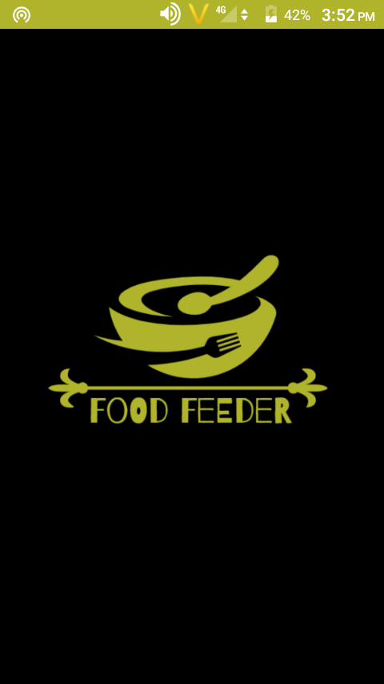
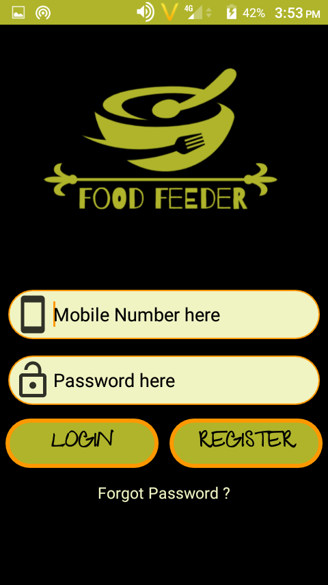
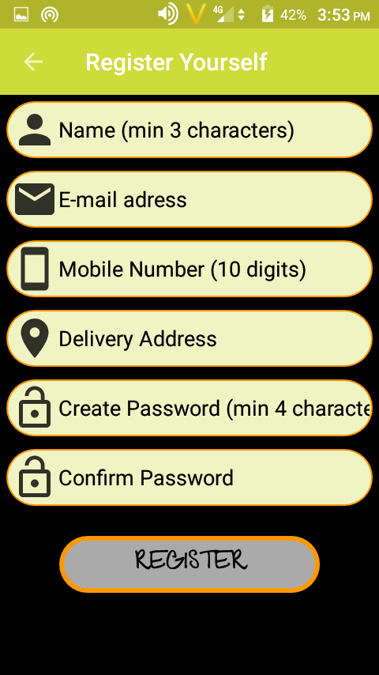
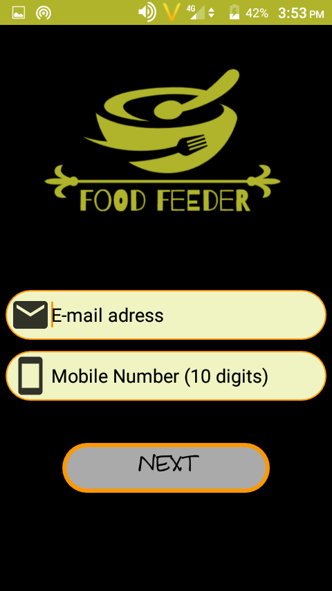
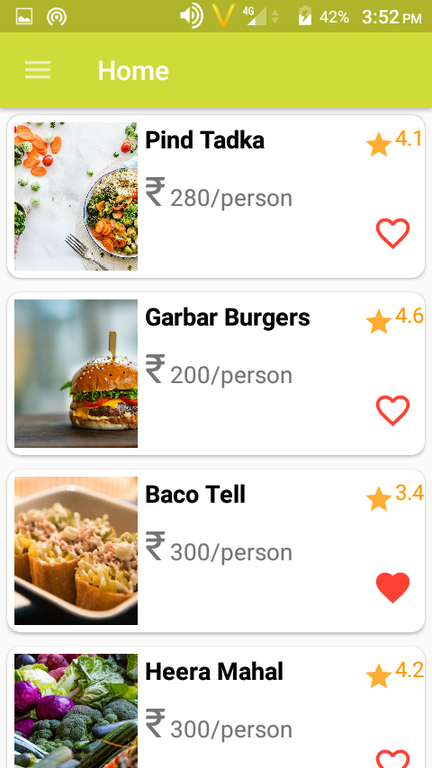
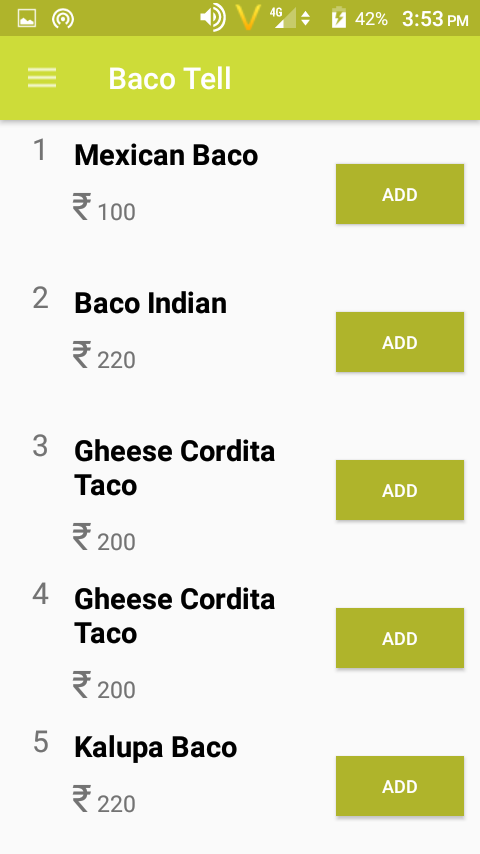
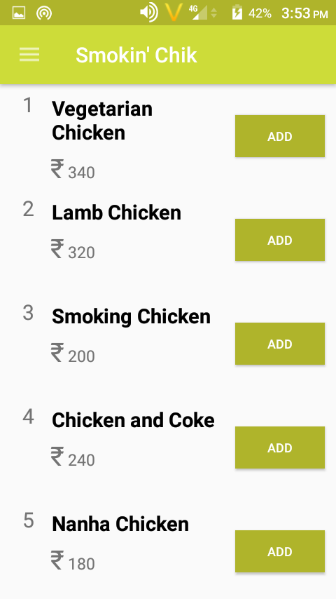
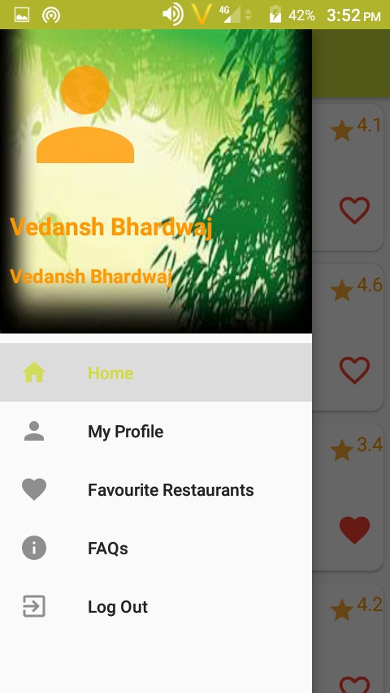
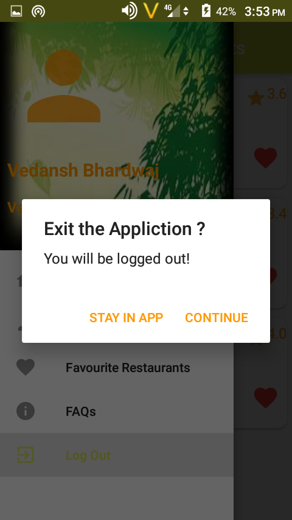

# Food-Feeder-Android-App
A reactive Zomato like app for food ordering.

### Installing the app - 
The link to the APK file of the app is attached [here](https://drive.google.com/file/d/1n0jmFcy-9wM4fWgkFPx2PsWMMgP7P-wd/view?usp=sharing) .
* You need to "Allow Apps from unknown source" to install the apk and run the app on your android device.

### Working - 
* The app first prompts the user to create an account.
* The user signs up and then logs-in.
* App displays a list of restaurants fetched from a **RESTful API**.
* User can click on the restaurant he wants and then see the food items the restaurant has.
* Can order any food from a restaurant and then confirm the order.
* User may also add some restaurants as favourites. Such "favourite" restaurants are stored in a local **SQLite database** using the **Room Persistence Library**.
* The app also has a navigation drawer where user can switch to tabs like, Dashboard, Favourites, Profile, FAQs or Logout.

### App Screens -
* *Splash Screen*

* *Login and Register Screens*

&nbsp;&nbsp;&nbsp;&nbsp;&nbsp;&nbsp;&nbsp;&nbsp;&nbsp;&nbsp;

* *Home Screen (Dashboard)*

* *Food Item Screen*

&nbsp;&nbsp;&nbsp;&nbsp;&nbsp;

* *Navigation Drawer Screen*

* *Logout Dialog Box*

